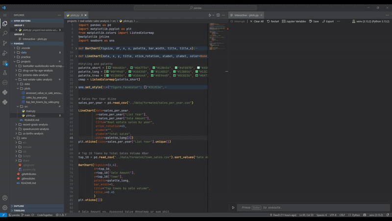

# About
This repository contains a couple of learning projects and some of my data science practice work.
(Repo updated everyday)

# Using:  
- **python 3.13.2**
- **pandas** for data processing
- **matplotlib** and **seaborn** for visualisation
- **jupyter** running inside a virtual environment in **VSC** (Example below)

# Environment showcase
 