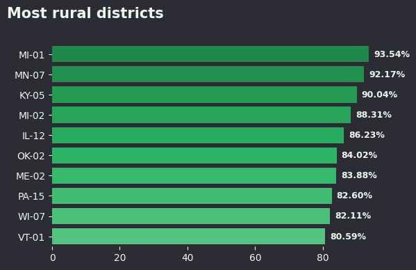
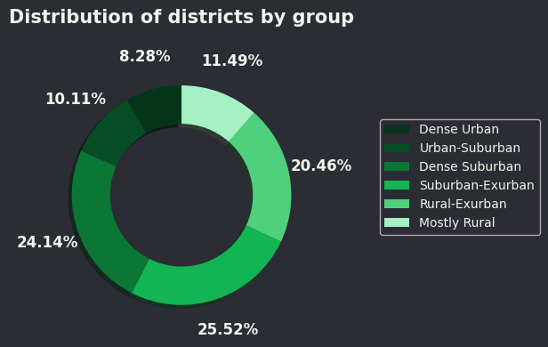

# Drug Use by Age Analysis

## Overview
Project is not yet finished, so I've decided to put it into practice folder. It will be done later today or tommorow.

## Dataset
- **Source:** [FiveThirtyEight Urbanization Index](https://github.com/fivethirtyeight/data/tree/4c1ff5e3aef1816ae04af63218015066e186c147/district-urbanization-index-2022)  
- **Location:** `projects/drug-use-by-age-analysis/data/raw/drug-use-by-age.csv`  
- **Size:** 435 rows × 10 columns 

## Processed Data
- Not finished

## Visualizations
-   
-   