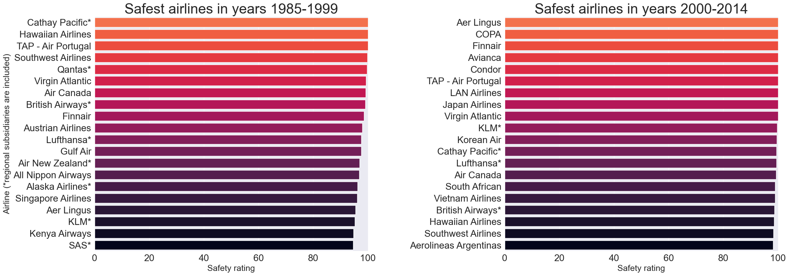
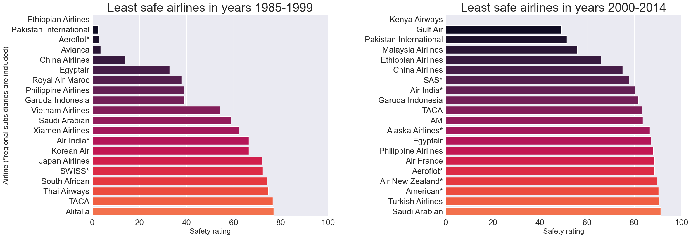
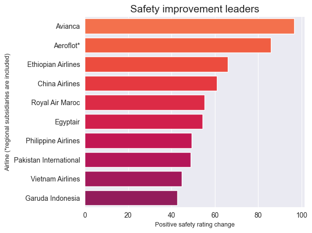
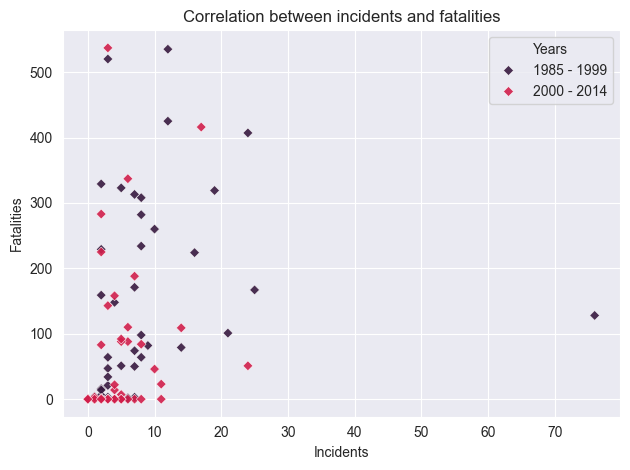
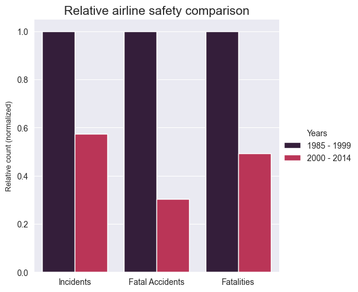

# Aviation Safety Analysis

## Overview
This project analyzes aviation safety data, comparing airline incident, accident, and fatality statistics between two periods: **1985–1999** and **2000–2014**.  
It includes data cleaning, processing, and multiple visualizations to highlight safety trends, improvements, and risks.

## Dataset
- **Source:** [FiveThirtyEight - Airline Safety](https://github.com/fivethirtyeight/data/tree/master/airline-safety)
- **Location:** `projects/aviation-safety-analysis/data/raw/airline-safety.csv`
- **Size:** 56 rows × 8 columns

## Processed Data
- `data/formated/airline_safety.csv` – Cleaned stats with safety ratings  
- `data/formated/total_safety.csv` – Global totals per period  
- `data/formated/correlation.csv` – Incidents vs. fatalities data  
- `data/formated/diff_between_periods.csv` – Period comparison (normalized)  
- `data/formated/fatality_rate.csv` – Rates per billion seat-km

## Visualizations
- 
- 
- 
- 
- 

