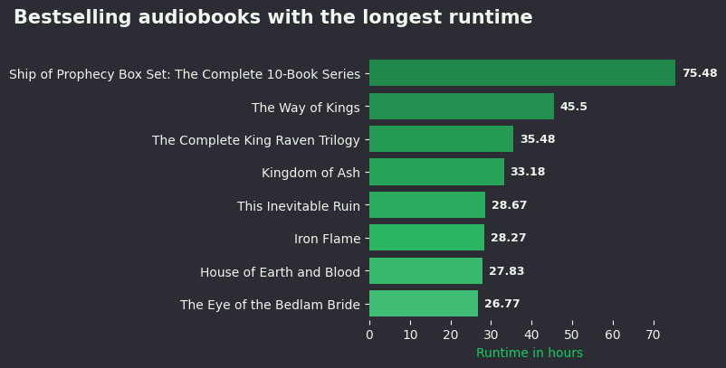

# Bestselling Audiobooks Analysis

## Overview
This project analyzes data from the Top 100 bestselling audiobooks scraped from [Audible](https://www.audible.com/charts/best).  
It includes both data processing and visualization scripts.

## Dataset
- **Source:** [Audible – Top 100 Bestselling Audiobooks](https://www.audible.com/charts/best)  
- **Location:** `projects/bestseller-audiobooks-web-scraping-analysis/data/raw/bestsellers_raw.csv`

## Scraped Data
- `projects/bestseller-audiobooks-web-scraping-analysis/data/scraped/bestsellers_scrape.csv`

## Processed Data
- `projects/bestseller-audiobooks-web-scraping-analysis/data/formated/highest_runtime.csv` – Audiobooks with the highest runtime  
- `projects/bestseller-audiobooks-web-scraping-analysis/data/formated/rating_runtime_correlation.csv` – Correlation between runtime and ratings  

## Insights
- Most audiobooks fall in 5 - 20 hour range 
- Audiobook ratings tend to be slightly lower for very short audiobooks (<10 hours), increase for mid-length audiobooks (15-30 hours), and slightly decline for audiobooks longer than 30 hours.

## Visualizations 
-   
-   
