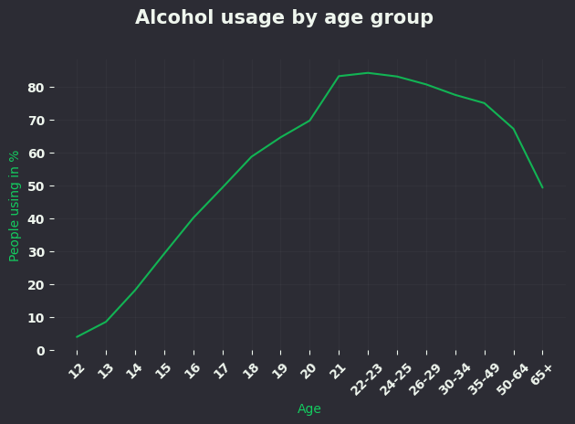
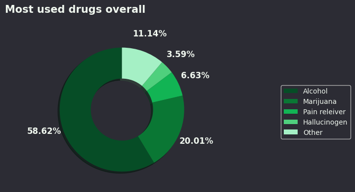
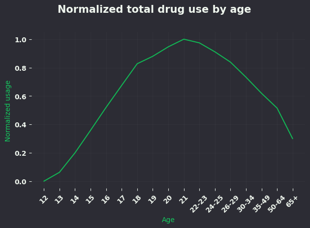

# Drug Use by Age Analysis

## Overview
This project analyzes drug usage patterns across different age groups using data from the  
[National Survey on Drug Use and Health](https://github.com/fivethirtyeight/data/tree/master/drug-use-by-age).  
It includes both data processing and visualization.

## Dataset
- **Source:** [FiveThirtyEight Data](https://github.com/fivethirtyeight/data/tree/master/drug-use-by-age)  
- **Location:** `projects/drug-use-by-age-analysis/data/raw/drug-use-by-age.csv`  
- **Size:** 17 age groups × 26 columns (13 drugs with usage and frequency)  

## Processed Data
- `projects/drug-use-by-age-analysis/data/formated/age_group_alcohol_use.csv` – Alcohol usage % by age group  
- `projects/drug-use-by-age-analysis/data/formated/marijuana_vs_alcohol_usage.csv` – Comparison of marijuana vs alcohol usage trends  
- `projects/drug-use-by-age-analysis/data/formated/most_used_drug_overall.csv` – Total usage across all drugs, ranked  
- `projects/drug-use-by-age-analysis/data/formated/most_using_age_group.csv` – Age groups with highest overall usage  

## Insights
- Alcohol usage starts very low in early teens (12-14), rises steadily through late teens and early 20s, peaks at ages 21-23 (~83%), then gradually declines in older age groups.
- Early 20s (21-23), aligning with legal drinking age in the US.
- Noticeable drop after age 50, with only ~50% usage in 65+.
- Drug use is highly age-dependent, peaking in early adulthood.

## Visualizations
-   
-   
-   
-   
