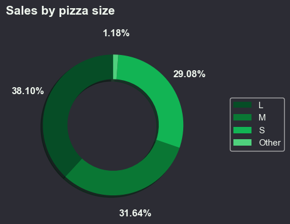
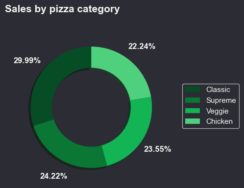
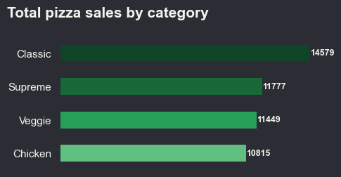
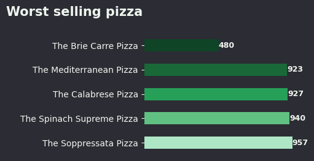

# Pizzeria data analysis

## Overview
This project analyzes sales and order data from a pizzeria. It includes data processing and visualization scripts to explore pizza sales trends, order patterns, and category performance. Visualizations, such as bar charts for total sales by category, best-selling pizzas, and worst-selling pizzas

## Dataset
- **Location:** `projects/pizzeria-data-analysis/data/raw/pizza_sales.csv`
- **Size:** 48620 rows × 12 columns

## Processed Data
- `data/formated/day_sales.csv` – Sales by day of the week 
- `data/formated/orders_by_hour.csv` – Orders grouped by hour  
- `data/formated/sale_numbers.csv` –  Sale numbers by pizza name
- `data/formated/sales_by_category.csv` – Sales per pizza category 
- `data/formated/sales_by_size.csv` – Sales by pizza size

## Visualizations
- 
- 
- 
- 
- 
- 
- 
- 