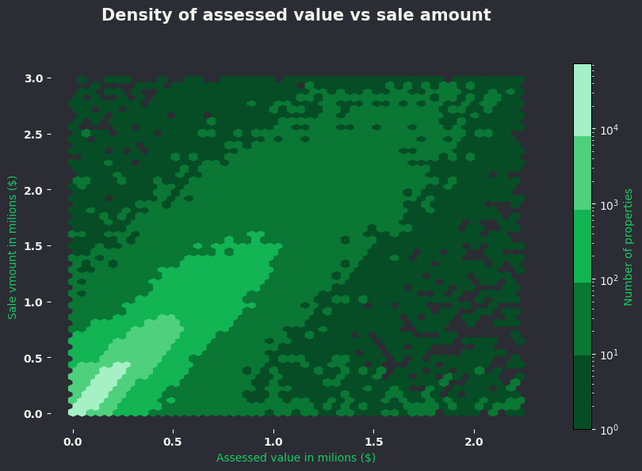

# Real Estate Sales Analysis

## Overview
This project analyzes real estate sales data from years 2001-2022.  
It includes both data processing and visualization scripts.

## Dataset
- **Source:** [Dataset from Kaggle](https://www.kaggle.com/datasets/abdullahkse/real-estat-sales-2001-2022?resource=download)
- **Location:** `projects/real-estate-sales-analysis/data/raw/Real_Estate_Sales_2001-2022_GL.csv`
- **Size:** 1097629 rows × 14 columns

## Processed Data
- `projects/real-estate-sales-analysis/data/formated/sale_vs_assessed.csv` –  Data for density calculations
- `projects/real-estate-sales-analysis/data/formated/sales_per_year.csv` – Sales grouped by year  
- `projects/real-estate-sales-analysis/data/formated/town_sales.csv` – Sales grouped by town  

## Insights
- Most properties sell within lower assessed and sale value ranges, showing a positive but uneven correlation between the two.
- Sales peaked in the mid-2000s, crashed after 2008, partially recovered in the 2010s, and fluctuated around the pandemic period.
- Urban centers like Bridgeport, Stamford, and Waterbury dominate real estate sales activity compared to smaller towns.

## Visualizations
-   
-   
- 
