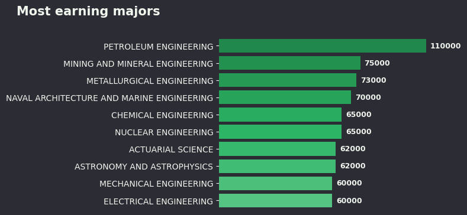
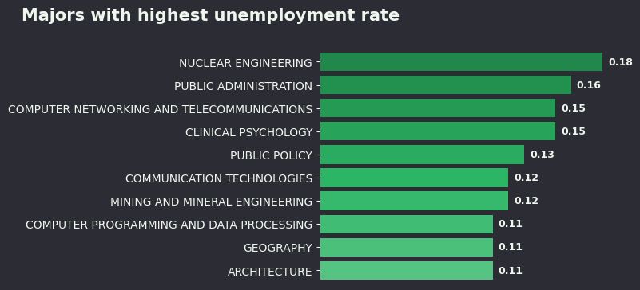
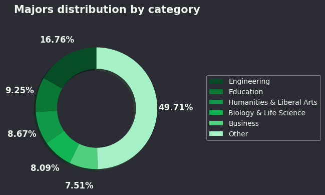

# Recent Grads Analysis

## Overview
This project analyzes recent college graduate data to explore salary distributions, unemployment rates, and the distribution of majors by category.  
It includes both data processing and visualization scripts.

## Dataset
- **Source:** [FiveThirtyEight - College Majors](https://github.com/fivethirtyeight/data/tree/master/college-majors)
- **Location:** `projects/recent-grads-analysis/data/raw/recent-grads.csv`
- **Size:** 173 rows × 21 columns

## Processed Data
- `projects/recent-grads-analysis/data/formated/median.csv` – Top majors by median salary  
- `projects/recent-grads-analysis/data/formated/unemployment.csv` – Majors with highest unemployment  
- `projects/recent-grads-analysis/data/formated/major_category.csv` – Distribution of majors by category  

## Analysis Highlights
- **Highest median salary:** Petroleum Engineering  
- **Highest unemployment rate:** Nuclear Engineering  
- **Most common major category:** Engineering

## Visualizations
-   
-   
- 
