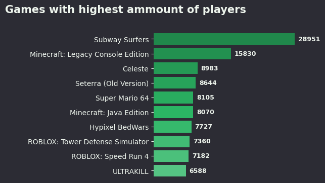
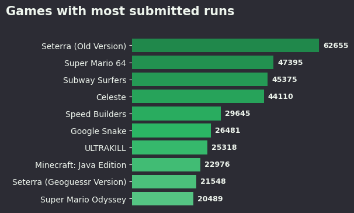

# Recent Grads Analysis

## Overview
This project analyzes data from popular website [Speedrun.com](https://www.speedrun.com).  
It includes both data processing and visualization scripts.

## Dataset
- **Source:** [Kaggle - Speedrun.com Dataset (API v2)](https://www.kaggle.com/datasets/alexmerren1/speedrun-com-data?resource=download)
- **Location:** `projects/recent-grads-analysis/data/raw/recent-grads.csv`
- **Size:** 44,122 rows × 9 columns

## Processed Data
- `projects/speedruncom-analysis/data/formated/count_per_year.csv` – Player and run count by year 
- `projects/speedruncom-analysis/data/formated/popular_games.csv` – Most popular games by playerCount (Includes runCount for easier calculations)
- `projects/speedruncom-analysis/data/formated/runs_per_player.csv` –  Games with highest average runs per player

## Visualizations
- 
- 
- 
- 
