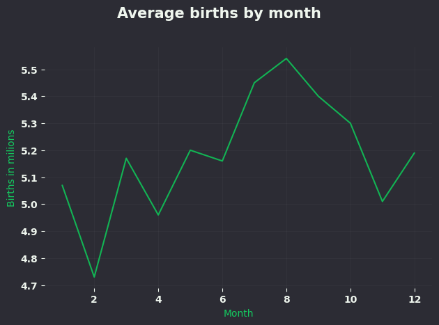
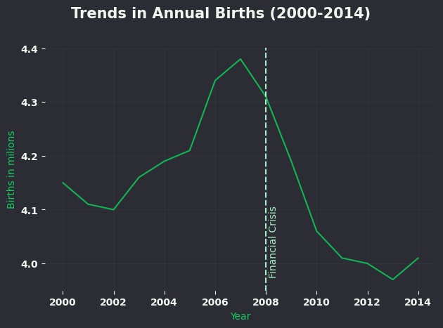
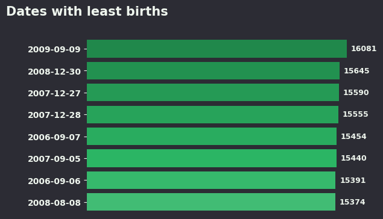
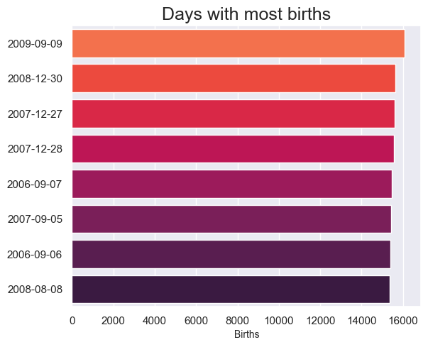
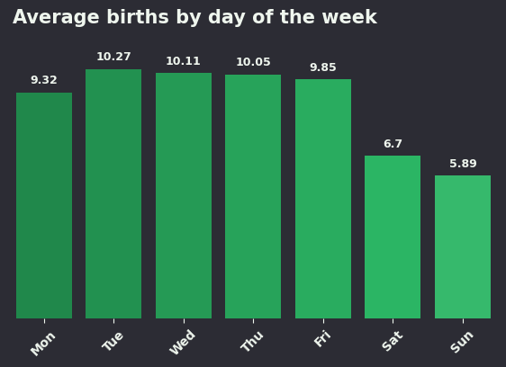
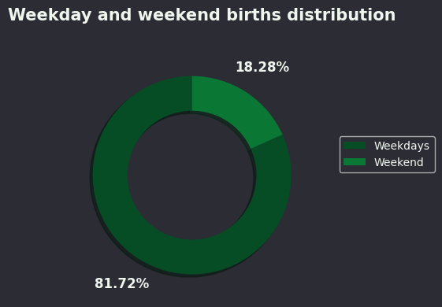

# US Births analysis

## Overview
This project analyzes data from [THIS](https://github.com/fivethirtyeight/data/tree/4c1ff5e3aef1816ae04af63218015066e186c147) repository.  
It includes both data processing and visualization scripts.

## Dataset
- **Source:** [FiveThirtyEight Repo](https://github.com/fivethirtyeight/data/tree/4c1ff5e3aef1816ae04af63218015066e186c147)
- **Location:** `projects/us-births-analysis/data/raw/US_births_2000-2014_SSA.csv`
- **Size:** 5,479 rows × 5 columns

## Processed Data
- `projects/us-births-analysis/data/formated/births_by_date.csv` – Birth counts grouped by exact date  
- `projects/us-births-analysis/data/formated/births_by_day.csv` – Birth counts grouped by day of the week  
- `projects/us-births-analysis/data/formated/births_by_month.csv` – Birth counts grouped by month  
- `projects/us-births-analysis/data/formated/highest_births_by_date.csv` – Dates with the highest recorded birth counts  
- `projects/us-births-analysis/data/formated/lowest_births_by_date.csv` – Dates with the lowest recorded birth counts  

## Insights
- July through September are the most common months for births in the US.
- The US birth rate began a significant decline around the time of the 2008 financial crisis.
- Significantly fewer births are scheduled on weekends, with Tuesday being the most common day.
- The vast majority of births (over 80%) occur on weekdays.

## Visualizations 
-   
-   
-   
-   
-   
-   
